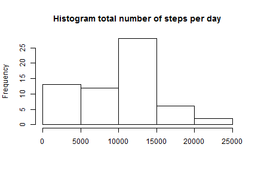
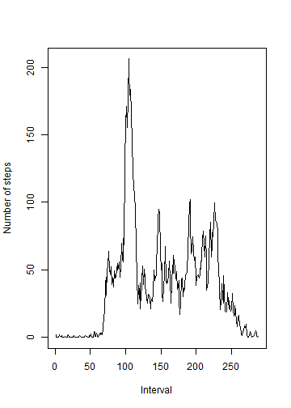
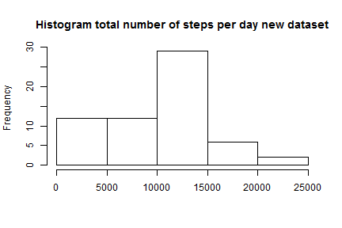
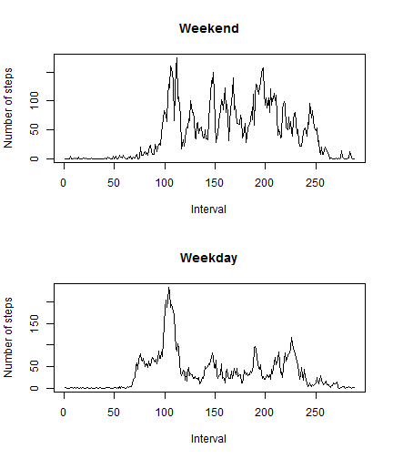

# Reproducible Research: Peer Assessment 1

## Loading and preprocessing the data
The data file is loaded using `read.csv2`:


```r
data <- read.csv2(file="./../activity.csv", header=TRUE, sep=",")
```
It is stored in a data frame called `data`.

## What is mean total number of steps taken per day?
The histogram of the total number of steps taken each day is shown below.

```r
total.steps.per.day <- tapply(data$steps, data$date, FUN=sum, na.rm=TRUE)
hist(total.steps.per.day,xlab="",main="Histogram total number of steps per day")
```

 

The mean of the total number of steps per day is below:

```r
mean(total.steps.per.day)
```

```
## [1] 9354
```
The median of the total number of steps per day is:

```r
median(total.steps.per.day)
```

```
## [1] 10395
```

## What is the average daily activity pattern?
The steps taken in each 5-minutes interval have been averaged across all days. 
The resulting time series is show below:

```r
mean.steps.interval <- tapply(data$steps, data$interval, FUN=mean, na.rm=TRUE)
plot(mean.steps.interval, type="l", ylab="Number of steps", xlab="Interval")
```

 

The 5-minute interval which contains the maximum number of steps on average 
across all the days in the dataset is:

```r
names(which.max(mean.steps.interval))
```

```
## [1] "835"
```

## Imputing missing values
The `NA` are only in the `steps` column, as it is seen in:

```r
sapply(data, function(x) length(which(is.na(x))))
```

```
##    steps     date interval 
##     2304        0        0
```

The code above shows how many `NA` are in the dataset.

The strategy for filling in the missing values in the dataset is to use the mean
for the corresponding 5-minute interval. A new dataset that is equal to the 
original dataset but with the missing dataset filled in is created below:

```r
new.data <- data
k <- is.na(new.data$steps)
new.data$steps[k] <- mean.steps.interval[which(names(mean.steps.interval)==new.data$interval[k])]
```
The histogram of the new dataset can be seen below:

```r
new.total.steps.per.day <- tapply(new.data$steps, new.data$date, FUN=sum, na.rm=TRUE)
hist(new.total.steps.per.day,xlab="",main="Histogram total number of steps per day new dataset")
```

 

The mean and median for total number of steps taken per day is reported below. 
The same values computed over the old data set is also reported for the sake of
comparison.

```r
comparison <- matrix(ncol=2,nrow=2)
comparison[1,1] <- mean(total.steps.per.day)
comparison[2,1] <- median(total.steps.per.day)
comparison[1,2] <- mean(new.total.steps.per.day)
comparison[2,2] <- median(new.total.steps.per.day)
rownames(comparison) <- c("mean","median")
colnames(comparison) <- c("old dataset","new dataset")
comparison
```

```
##        old dataset new dataset
## mean          9354        9531
## median       10395       10439
```
As it can be seen, the `mean` and `median` values for the set with imputed
missing values are greater than the same values for the dataset with missing
values.

## Are there differences in activity patterns between weekdays and weekends?
The first step is to add a new column to the `new.data` dataset indicating if
the day belongs to the weekend or not. The function below is intended for a 
computer using Spanish as default language. After forming the new variables the
means are computed.

```r
type.of.day <- function(x){
        d <- weekdays(as.POSIXct(x))
        if (d=="sábado"|d=="domingo")
                tod <- "weekend"
        else
                tod <- "weekday"
        return(tod)
}
new.data <- cbind(new.data, as.factor(sapply(new.data$date, type.of.day)))
names(new.data)[4] <- "type"
# Mean computation
k <- new.data$type=="weekday"
mean.weekday <- tapply(new.data$steps[k], new.data$interval[k], FUN=mean, na.rm=TRUE)
k <- new.data$type=="weekend"
mean.weekend <- tapply(new.data$steps[k], new.data$interval[k], FUN=mean, na.rm=TRUE)
```
Once the means are computed we can represent them:

```r
par(mfrow=c(2,1))
plot(mean.weekend, type="l", xlab="Interval", ylab="Number of steps", main="Weekend")
plot(mean.weekday, type="l", xlab="Interval", ylab="Number of steps", main="Weekday")
```

 


